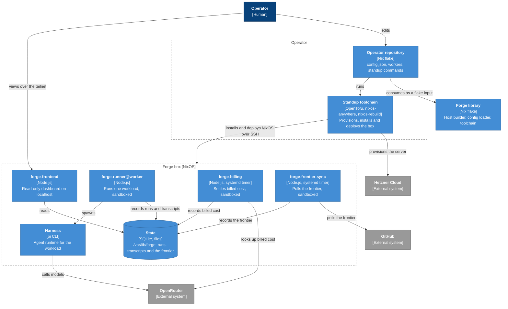
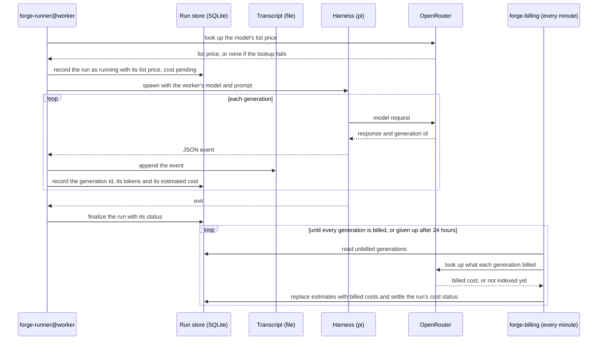

#  Forge

> A declarative software factory.

Forge runs agent workloads on a machine you define declaratively.

You declare **workers** in Nix, each binding a harness (such as `pi`) to a model and a prompt, and the **managed repositories** whose tickets they work on.

Forge stands up a NixOS box to run them on, and every run of a worker is an isolated **workload**.

Forge records each workload's transcript, token usage and billed cost, and shows them on a dashboard, so you can trace what every worker did and feed that back into improving your workers. The dashboard also shows the **frontier** of each managed repository: the tickets ready for an agent to pick up now.

## How it works

### Around Forge

Forge sits between the operator, the provider that hosts the box, and the model provider its workloads call.


### Inside Forge

The operator repository stands the box up with the standup toolchain. On the box:

- a runner runs each workload
- a billing service settles each run's billed cost
- a frontier service polls each managed repository's frontier
- a dashboard, served only on your tailnet, shows what they record



### A workload run



## Get started

Scaffold an operator repository:

```bash
nix flake init -t github:rameezk/forge
```

Then follow the scaffolded repository's [README](templates/operator/README.md) to generate secrets, stand up the box, deploy workers and open the dashboard.

## Learn more

- [`docs/CONTEXT.md`](docs/CONTEXT.md) - the shared language
- [`docs/adr/`](docs/adr) - the key decisions behind Forge and why they were made

## Why the name Forge

Forge is named after [Forge](https://en.wikipedia.org/wiki/Forge_(Marvel_Comics)), the Marvel mutant whose power is an intuitive genius for inventing machines.

> _"It always starts with a problem. An impractical, unattainable, unworkable problem that needs to be solved. Then... I solve it. I work it. I attain it. I move and shift and reshape. Make something out of nothing."_
>
> <sub>Forge, in [_Extraordinary X-Men_ #18](https://marvel.fandom.com/wiki/Extraordinary_X-Men_Vol_1_18)</sub>
