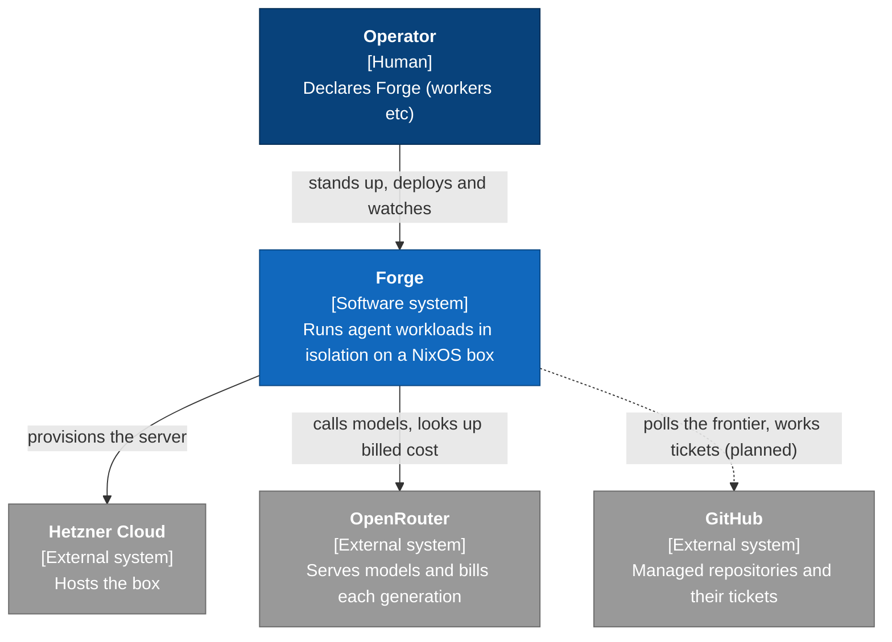
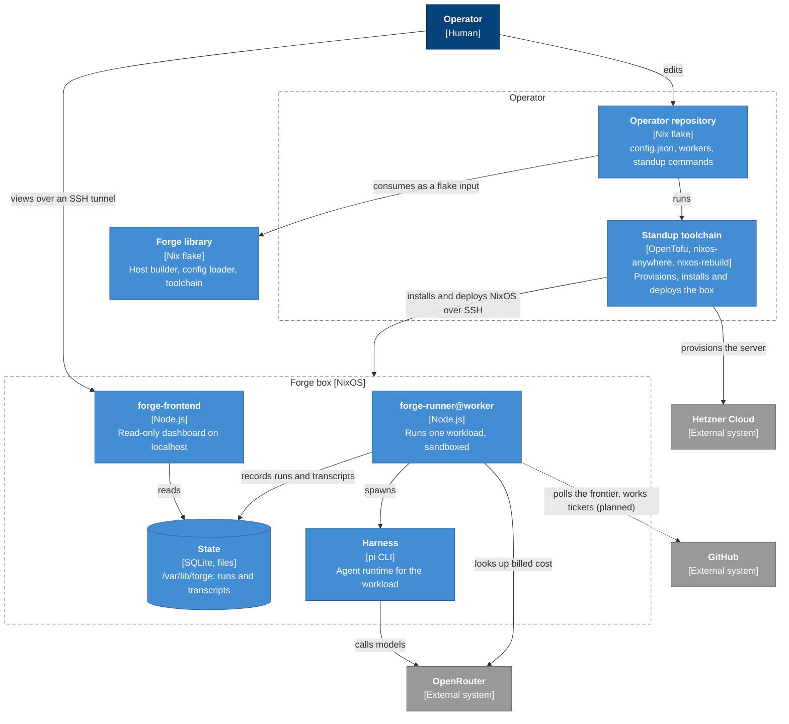
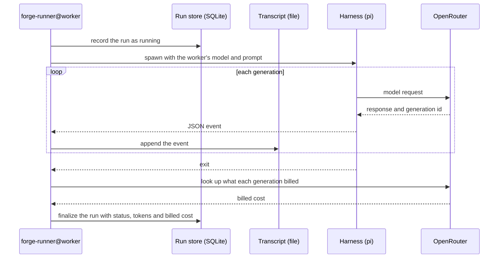

# Forge

> A declarative software factory.
>
> <sub>Named after the Marvel mutant [Forge](https://en.wikipedia.org/wiki/Forge_(Marvel_Comics)), whose power is an intuitive genius for inventing machines.</sub>

Forge runs agent workloads on a machine you define declaratively.

You declare **workers** in Nix, each binding a harness (such as `pi`) to a model and a prompt.

Forge stands up a NixOS box to run them on, and every run of a worker is an isolated **workload**.

Forge records each workload's transcript, token usage and billed cost, and shows them on a dashboard, so you can trace what every worker did and feed that back into improving your workers.

## How it works

> [!NOTE]
> Dashed edges are planned and not built yet.

### System context

Forge sits between the operator, the provider that hosts the box, and the model provider its workloads call.



### Containers

The operator repository stands the box up with the standup toolchain. On the box, the runner runs each workload and a localhost-only dashboard reads what it recorded.



### A workload run

One run of a worker, from start to its recorded billed cost.



## Get started

1. Scaffold an operator repository:

   ```bash
   nix flake init -t github:rameezk/forge
   ```

2. Fill in `config.json` from `config.example.json` with your SSH key, hostname and server, and add your Hetzner token to `.env`.
3. Create the box with `just standup`, then place your OpenRouter key on it.
4. Declare workers in `flake.nix` and apply them with `just deploy`, which keeps the box's state.
5. Open the dashboard over an SSH tunnel with `ssh -L 7787:localhost:7787 forge@<address>`, then browse to `http://localhost:7787`.

The scaffolded repository's README walks through each step in full.

## Learn more

- [`docs/CONTEXT.md`](docs/CONTEXT.md) - the shared language
- [`docs/adr/`](docs/adr) - the key decisions behind Forge and why they were made
